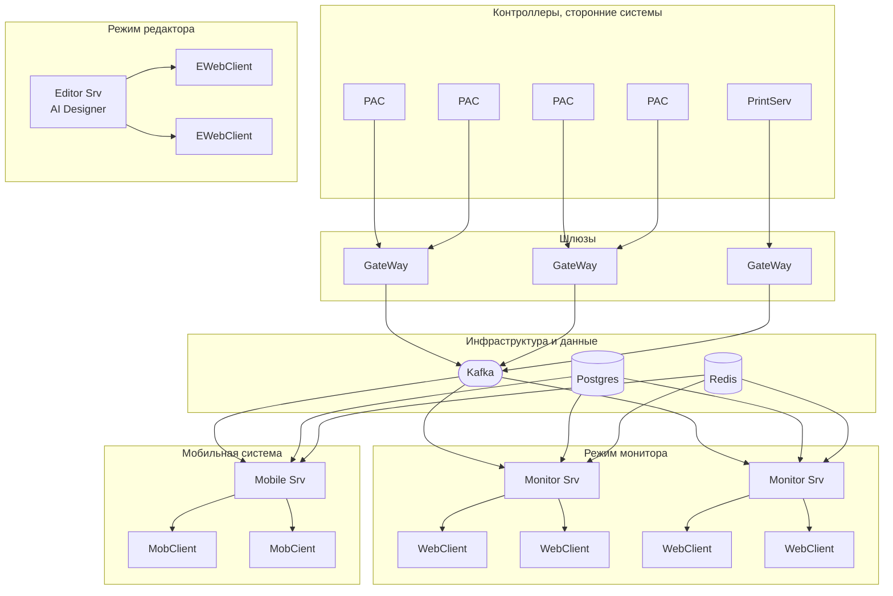

```mermaid
graph TD
    subgraph "Контроллеры, сторонние системы"
        C1["PAC"]
        C2["PAC"]
        C3["PAC"]
        C4["PAC"]
        C5["PrintServ"]
    end

    subgraph "Шлюзы"
        gw1["GateWay"]
        gw2["GateWay"]
        gw3["GateWay"]
    end

        subgraph "Режим монитора"
            MSrv1["Monitor Srv"]
            MSrv2["Monitor Srv"]
            Mc1["WebClient"]
            Mc2["WebClient"]
            Mc3["WebClient"]
            Mc4["WebClient"]
        end

        subgraph "Режим редактора"
            ESrv["Editor Srv <br/> AI Designer"]
            Ec1["EWebClient"]
            Ec2["EWebClient"]
        end

        subgraph "Мобильная система"
            MobSrv["Mobile Srv"]
            Mob1["MobClient"]
            Mob2["MobCient"]
        end

    subgraph "Инфраструктура и данные"
        direction LR
        Kafka([Kafka])
        Postgres[(Postgres)]
        Redis[(Redis)]
    end

    %% --- Соединения ---

    %% Клиенты -> Шлюзы
    C1 & C2 --> gw1
    C3 & C4 --> gw2
    C5 --> gw3

    %% Шлюзы -> Kafka -> Мониторинг
    gw1 --> Kafka
    gw2 --> Kafka
    gw3 --> Kafka
    Kafka --> MSrv1
    Kafka --> MSrv2
    Kafka --> MobSrv
    Postgres --> MSrv1
    Postgres --> MSrv2
    Postgres --> MobSrv
    Redis --> MSrv1
    Redis --> MSrv2
    Redis --> MobSrv


    %% Сервисы мониторинга -> Mc
    MSrv1 --> Mc1 & Mc2
    MSrv2 --> Mc3 & Mc4

    %% Соединения системы редактора
    ESrv --> Ec1 & Ec2  

    %% Соединения мобильной системы
    MobSrv --> Mob1 & Mob2

```
