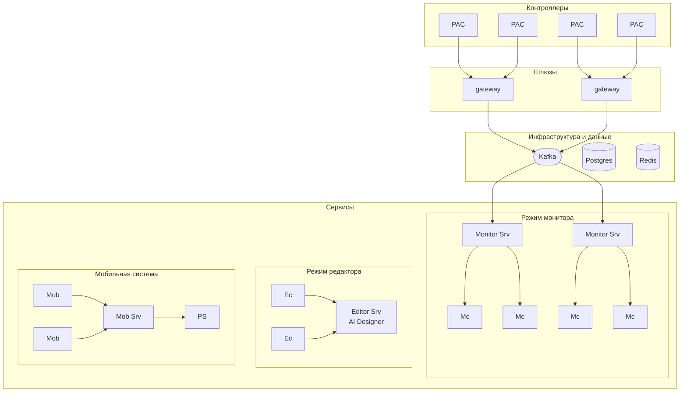

```mermaid
graph TD
    subgraph "Контроллеры"
        C1["PAC"]
        C2["PAC"]
        C3["PAC"]
        C4["PAC"]
    end

    subgraph "Шлюзы"
        gw1["gateway"]
        gw2["gateway"]
    end

    subgraph "Сервисы"
        subgraph "Режим монитора"
            MSrv1["Monitor Srv"]
            MSrv2["Monitor Srv"]
            Mc1["Mc"]
            Mc2["Mc"]
            Mc3["Mc"]
            Mc4["Mc"]
        end

        subgraph "Режим редактора"
            ESrv["Editor Srv <br/> AI Designer"]
            Ec1["Ec"]
            Ec2["Ec"]
        end

        subgraph "Мобильная система"
            MobSrv["Mob Srv"]
            PS["PS"]
            Mob1["Mob"]
            Mob2["Mob"]
        end
    end

    subgraph "Инфраструктура и данные"
        direction LR
        Kafka([Kafka])
        Postgres[(Postgres)]
        Redis[(Redis)]
    end

    %% --- Соединения ---

    %% Клиенты -> Шлюзы
    C1 & C2 --> gw1
    C3 & C4 --> gw2

    %% Шлюзы -> Kafka -> Мониторинг
    gw1 --> Kafka
    gw2 --> Kafka
    Kafka --> MSrv1
    Kafka --> MSrv2

    %% Сервисы мониторинга -> Mc
    MSrv1 --> Mc1 & Mc2
    MSrv2 --> Mc3 & Mc4

    %% Соединения системы редактора
    Ec1 & Ec2 --> ESrv

    %% Соединения мобильной системы
    Mob1 & Mob2 --> MobSrv
    MobSrv --> PS
```
